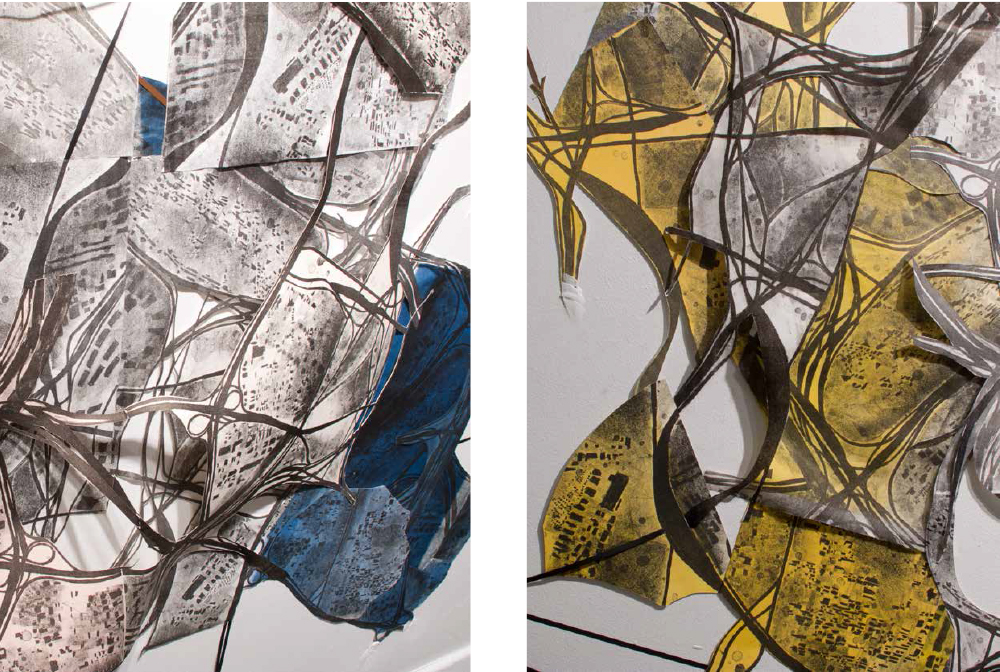
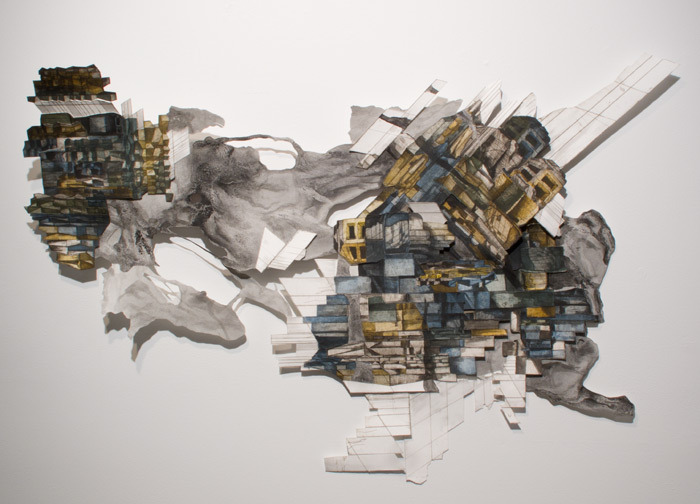
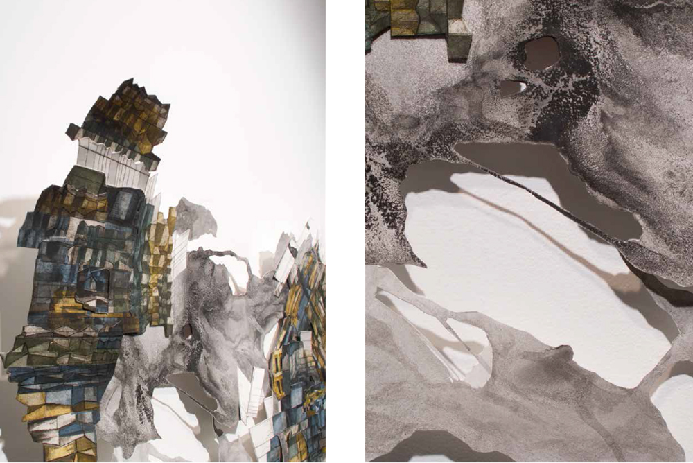
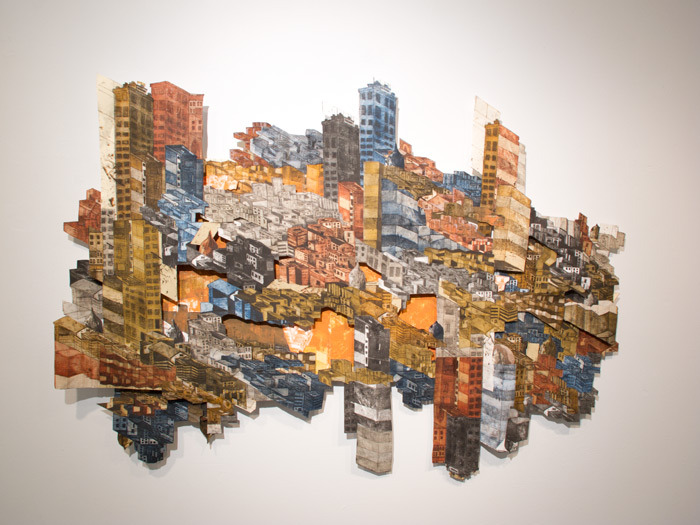
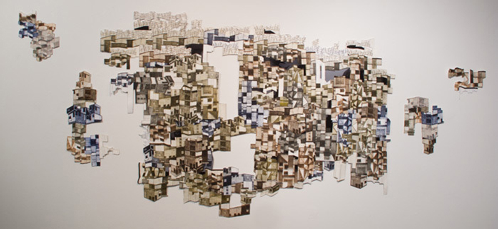
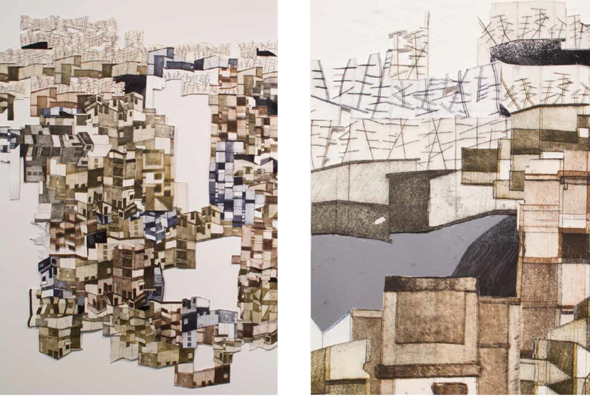

<figcaption>Carceral Armature, Lithograph, Magnetic Tape, 2012</figcaption>

I am interested in exploring the connection between personal identity and external environment, specifically focusing on urban density. I am engaged with the idea that as we navigate our environment, we create an internal model — a mental map of our surroundings and our place within those surroundings. This internal model may or may not accurately reflect the external world. The connections and contradictions that occur when these two environments collide create definition of personal identity. If identities are shaped by cities, cities are shaped by collected identities. This is an intangible and emergent property rising from the imaginations of an entire cities inhabitants. In this fluid exchange, cities become organisms.

<figcaption>Carceral Armature, Detail</figcaption>

The "hard" city of infrastructure and physical space creates the framework that the "soft" city of emotion, recollection, and assumption rests on. Urban structure and culture parallels the interactive relationship between human mind and body. Urban growth creates a feedback loop where change in individuals creates change in city, which effects further change in individuals. Our actions weigh on the city, but by inhabiting it we are irrevocably influenced.

<figcaption>All Cities Are Built Twice, Etching, Tusche Wash, 2012</figcaption>

<figcaption>All Cities Are Built Twice, Detail</figcaption>

In the language of mechanical reproduction, this work uses printmaking as its primary medium in order to create densities of visual texture, and comment on a world of analog and digital reproduction. Print allows some degree of non-linear process. Through the use of the multiple, stage proofing, and the technique of chine-collé, I am able to create an image that layers over itself at different stages of time. This collapsing of image is present in all the work, sometimes being composited, sliced apart, and re-composited until the original is entirely removed and a new image exists over its deconstructed framework. Each piece is based upon a single system of relationships and gridded framework co-opted from a typographic practice, reflecting the hard infrastructures of construction and communication that contemporary society is built on. Writing systems are a central component of my work in that they allow an individual to create a permanent mark of their thoughts on the environment. Writing is a direct externalization of identity. Through abstraction of city form and iconography, I seek to reflect the abstract forces that fundamentally guide our globalized world.

<figcaption>An Exact Replica of a Thing that Never Existed, Etching, Silkscreen, 2012</figcaption>

<figcaption>An Exact Replica of a Thing that Never Existed, Detail</figcaption>

I am focusing on the blurred distinction between human geography and physical geography as it comments on post-modern urbanism, issues of sprawl and lack of specificity and physical place in a post-geographic, globalized system of living on a human level. I examine the connections to local environment and context within the global city. With these prints, I seek to examine the current relevancy of both physical and informational infrastructures, from highways to the internet, shipping lines to global markets, built environments to typographic systems, in defining place and self.

<figcaption>The Capacities of the Human Body to Locate Itself, Etching, Giclee, 2012</figcaption>

<figcaption>The Capacities of the Human Body to Locate Itself, Detail</figcaption>

#### Bibliography

##### Gibson, William. “Dead Man Sings”, _Distrust That Particular Flavor_. New York: Putnam Group, 2012

A short essay discussing the unnoticed shift that human life took when analog, and later digital, media started to elongate our collective memories. Interesting discussion of what effect locating identities and human narratives outside of our head, or oral traditions, can have on a society.

##### Gibson, William. _Pattern Recognition_. New York: Berkley Publishing Group, 2003

Gibson’s seventh novel. A densely layered quasi-narrative dealing with problems of geographic specificity, globalized fashion trends and trade, the power of corporations in the realm of cultural influence, and the capabilities of pareidolia and obsession.

##### Calvino, Italo. _Invisible Cities_. Orlando: Harcourt, 1974

Calvino describes cities are as they felt and lived in experientially rather than descriptively or objectively. He raises issues of mirroring, reflecting, and the relationships between person and place. As he dissects and lays bare a single city, questions of semantic reasoning and possibilities of communication are raised.

##### Dear, Michael, Flusty, Steven. "Postmodern Urbanism." _Annals of the Association of American Geographers_, Vol. 88, No. 1 (Mar., 1998), pp. 50-72

Dear and Flusty set out to describe how the modernist Chicago School theory of urbanism does not hold with post-modern geographies, in particular Los Angeles. They describe the city structure of Los Angeles in relation to landscape opportunities and necessities, population demographics, and market pressures of late-stage capitalism. They go on to describe how the physical regions of the post-modern city are indicative of social structures, and how these hierarchies either enforce or subvert cultural patterns. They forecast a city with the post-modern structures of Los Angeles taken to dystopian extremes.