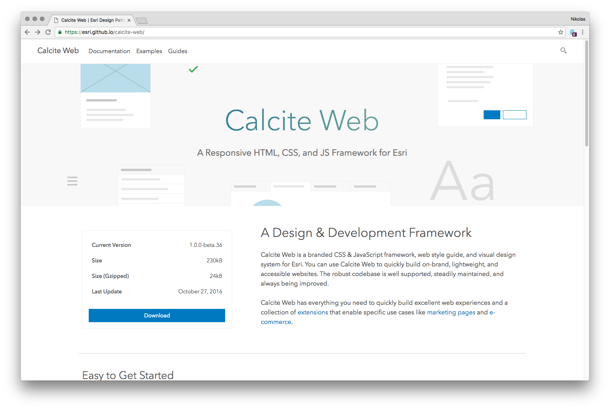
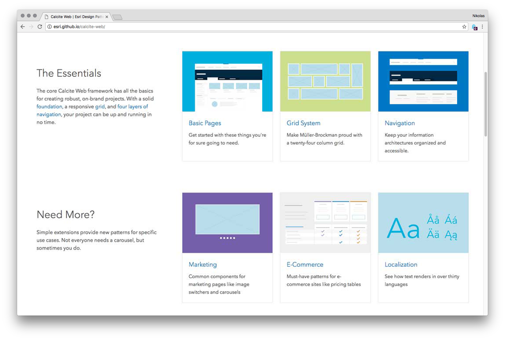
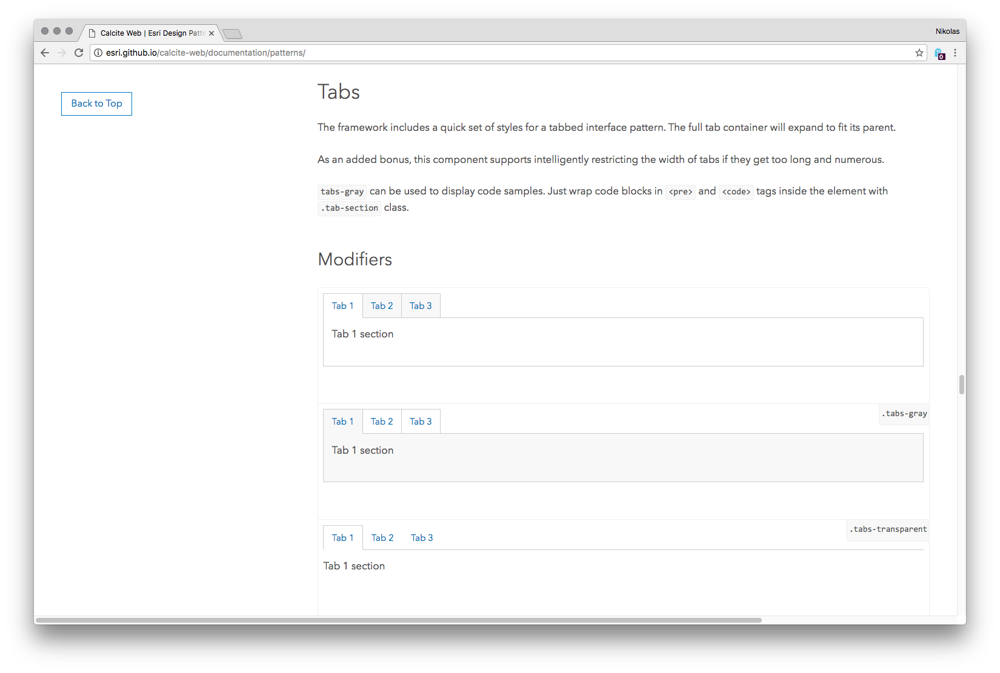
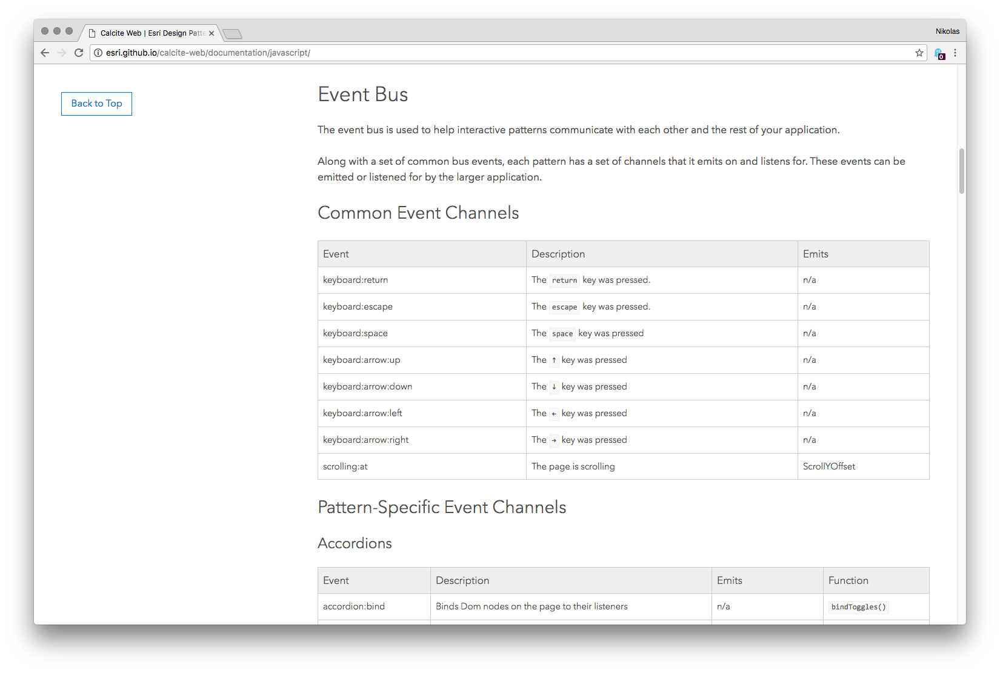
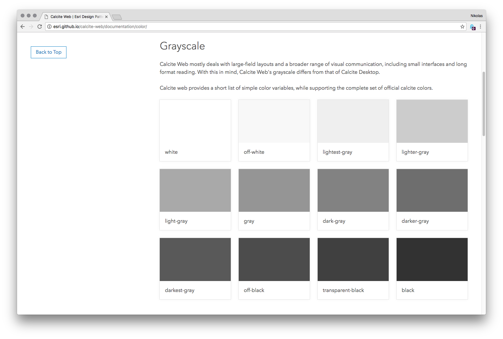
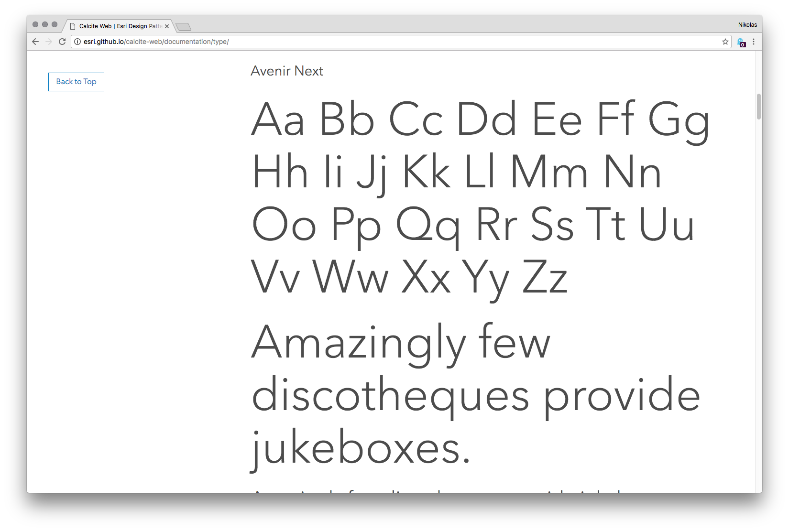

#### Design System, Development Framework

[Esri](http://www.esri.com/about-esri) is a large, international technology company with development teams all over the world — from Portland to Glasgow to Zurich to Beijing. Esri's _design_ team however, is based in the Redlands, California mother-ship. This meant that a lot of the design tools created for Esri's web presence were unevenly distributed across the huge number of teams who needed to develop web properties.

At [Esri PDX R&D](http://pdx.esri.com/) we had [assembled](http://paulcpederson.com/) a [strong](http://patrickarlt.com/) [team](http://ungoldman.com/) of designer/developers. We sat down to create a design system that we could distribute to _all_ of Esri's development teams, with the goal of creating a unified user experience for all our customers, and keeping all of our properties aligned and in sync as we moved forward.



#### Goals

Building a design library and CSS framework can be a complicated affair, made more complicated by the large audience of developers we had to make the project work for.

**Adoption:** We had to make the framework incredibly attractive to Esri developers, and incredible easy for them to use. Our main goal was unification, so any barriers to adoption needed to be removed.

**Composabillity:** To this end, we needed using the framework to be as simple is including a CSS file and copy-pasting code samples.

**Modularity:** Many of the projects at Esri have rigid, preexisting code bases and technologies that we needed to integrate smoothly with — we needed to provide a system that works in whatever tech stack it finds itself in.

**No Opinions:** We wanted the framework to provide a full set of interactive patterns — requiring JavaScript — but also work in any JavaScript framework environment.

**Robust:** Certain aspects of the framework — like [the grid system](/projects/viewport-grid) had major functional requirements. The grid itself needed to be column based, fully responsive by default, and work down to IE 8.

**Flexible:** Developers needed to have access to a wide range of patterns, ensuring that common structures didn't get independently invented in different projects. Designers needed to have the freedom to create on-off pages that stood out without feeling constricted.



#### Using Sass

Sass — through the [Node Sass project](https://github.com/sass/node-sass) allowed us to meet many of our goals. A major theoretical underpinning to the framework's .SCSS involved making the specificity graph as flat as possible, and decoupling style code from selectors. This allows the design code to be reused and adapted basically anywhere in any given project.

```
@mixin tab-contents() {
  @include box-sizing(border-box);
  border: 1px solid $lighter-gray;
  margin-top: -1px;
}
@if $include-tabs == true {
 .tab-section { @include tab-section(); }
}
```

The CSS development principles are outlined in [an excellent article (and Esri User Conference presentation) by Paul Pederson.](http://paulcpederson.com/articles/css-for-people-who-hate-css/)

#### JavaScript, or Not

All of our interactive patterns require a `.js-` prefix hook to bind JS events too. This lets projects using [Angular](https://angularjs.org/) or [React](https://facebook.github.io/react/) to write their own component code for the interactions while still getting all the canonical design code for a pattern.



The JS portion of the framework uses Publication / Subscription event bus to connect user intent and component behavior. This allows for programmatic control of the UI, and lets a pattern communicate to the rest of the application. The JavaScript library is written as a set of ES6 modules, and is compiled to an ES5 UMD module, attaching itself to the `window` on load.



#### The Brand

Color and Typography do most of the heavy lifting when communicated brand identity on the Web. We developed a gray scale, and selected a limited set of colors from the immense set of [Esri's color pallete](https://github.com/Esri/calcite-colors) to expose as simple color classes and variables. We updated the typography to Avenir NExt by Adrian Frutiger and Akira Kobayashi to give Esri's classic Avenir print style a boost that it needed for screen display.



#### Conclusion

The framework as been very successful so far — being integrated into new designs for esri.com, new sections of [ArcGIS Online](http://www.arcgis.com/home/item.html?id=52bdc7ab7fb044d98add148764eaa30a), and a number of [related ArcGIS properties](https://developers.arcgis.com/).
