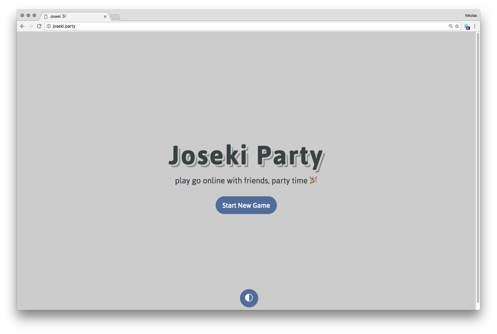
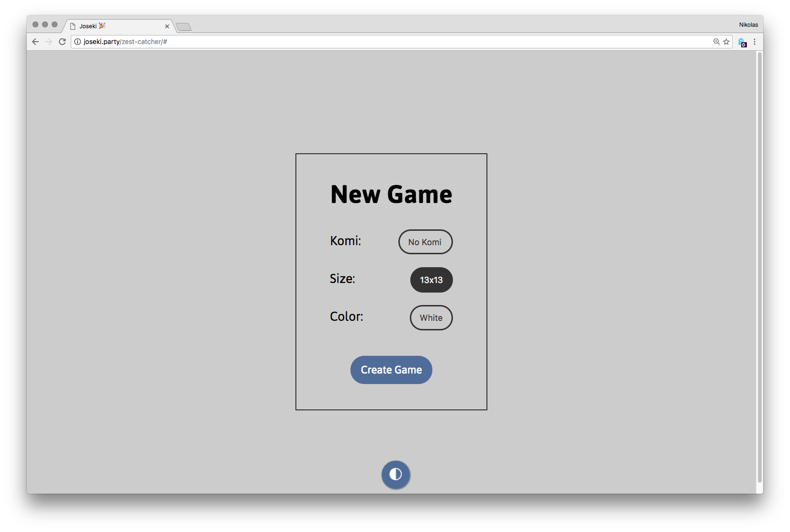
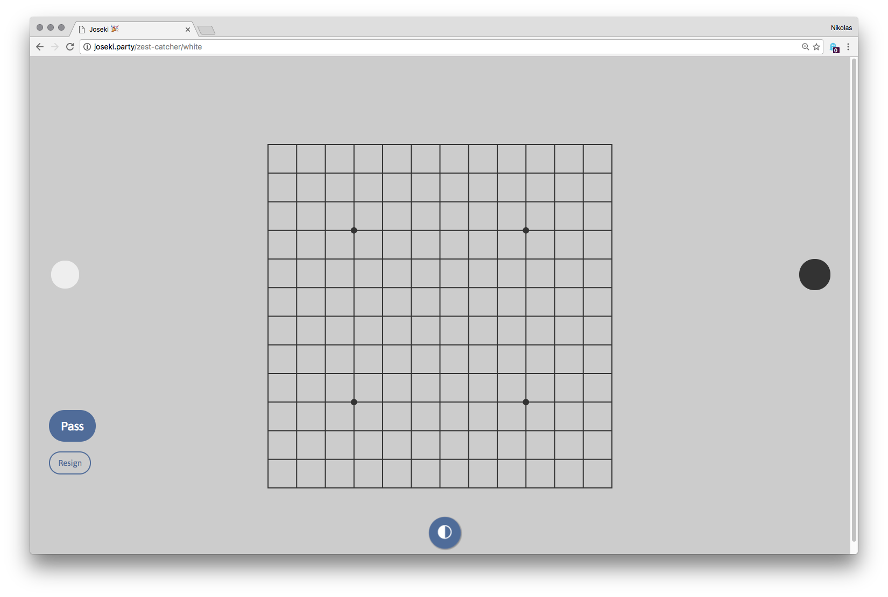
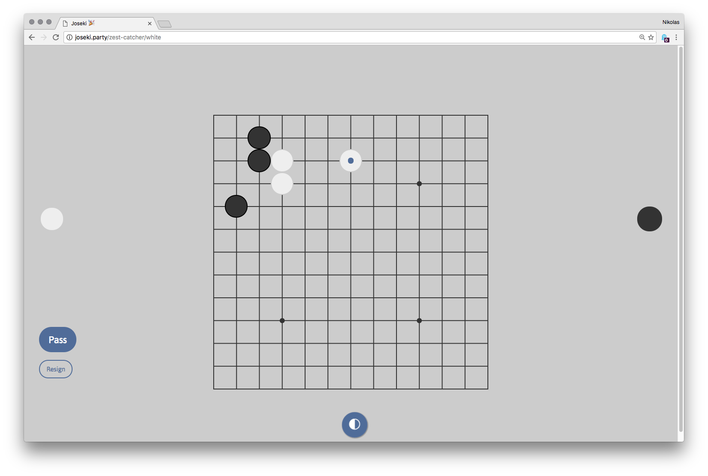
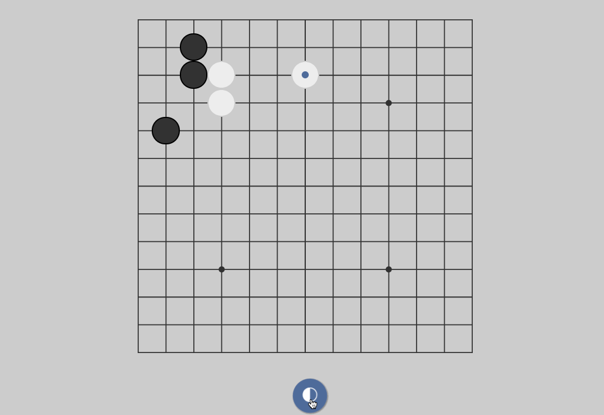

#### Concept

I've been playing Go (poorly) for the past 10 years or so ( on and off), so when [Paul](http://paulcpederson.com/) asked me if I knew how to play after the recent [triumph of AlphaGo]() over Lee Sedol, 9 Dan, I was pretty excited to have an opponent. Paul learned the game quick and soon was playing at my level (and slightly above!). We played over lunch, and one day when we were both working from home rather than the office, we decided to see what was out there for playing online.

While there are some amazing servers out there for playing Go like [Online Go](https://online-go.com/), [KGS](https://www.gokgs.com/), and [Tygem Baduk](http://www.tygembaduk.com/), they all required a significant amount of set up, investment, and it was tricky for us to just pick up a game with each other right away. What we needed was a Go server where one player could send a URL to the other and start playing.

So we built that!

#### The Big Idea

We had a couple of hard requirements for the project, which shaped a lot of our design decisions.

**No Auth:** We wanted to avoid any sort of user account management — no creating accounts, no signing in, no OAuth with Twitter or Facebook so you can share post your game points. This was going to be about zero-friction Go. Any set up where a user has to do anything beyond start playing when they got a link was off the table.

**No Server:** Paul and I are front-end types — we both know plenty of NodeJS but dislike writing servers. This was going to be pure client-side.

**No Framework:** There's been a _lot_ of discourse about the state of JavaScript frameworks in 2016. And after using any number of different frameworks for any number of projects (and one notable example of 4 frameworks in _one_ project) I thought we could experiment with [Vanills JS](http://vanilla-js.com/) and see where that landed us.

**Live:** It's a game, so we decided it should feel as close as possible to sitting down and playing a game. We wanted to avoid browser refreshes, notifications, and things of that nature. When you play, your opponent sees the move. When your opponent plays, you see the move.

**MVI Loops:** A major part of the project was getting deep into the practicalities of writing [unidirectional applications](http://staltz.com/unidirectional-user-interface-architectures.html) with a Model → View → Intent system.

**A New Visual Language:** One of my major design interests is in the translation between the analog and the digital. I wanted to take the same approach to the aesthetics of Go — attempt the keep the striking nature of the game itself but ditch any attempt at skeuomorphism that pervades practically _all_ of the computer Go programs I've ever played on.

#### Solutions

**[Firebase](https://firebase.google.com/)** solved a lot of our problems with the practicalities of a shared, live game state without using a server. We decided on generating random names for games, and saving the model of the game state under those keys in a single Firebase project. The NPM project **[Weiqi by cjlarose](https://www.npmjs.com/package/weiqi)** provided the essential client-side tools for manipulating the game, with a small addition in a **[fork of the project](https://github.com/nikolaswise/weiqi.js)** to add a method for removing dead stones from the board before scoring. **[Surge](https://surge.sh/)** provides the hosting, and their excellent **[client side routing](https://surge.sh/help/adding-a-200-page-for-client-side-routing)** allowed us to make the whole thing a single page app.

The client side routing lets us provide a single link to Black, White, or a neutral observer who just wants to watch the game unfold.

#### The Fun Parts

Exploring different aesthetics that our game board could take was a real interesting undertaking — one that is still ongoing. With the perpetually fluid nature of the web, we can create any number of wildly unorthodox color schemes.

So send me a link if you want to play! I've been playing nothing but 13x13 lately, so start a bigger game and I'll probably be toast.
