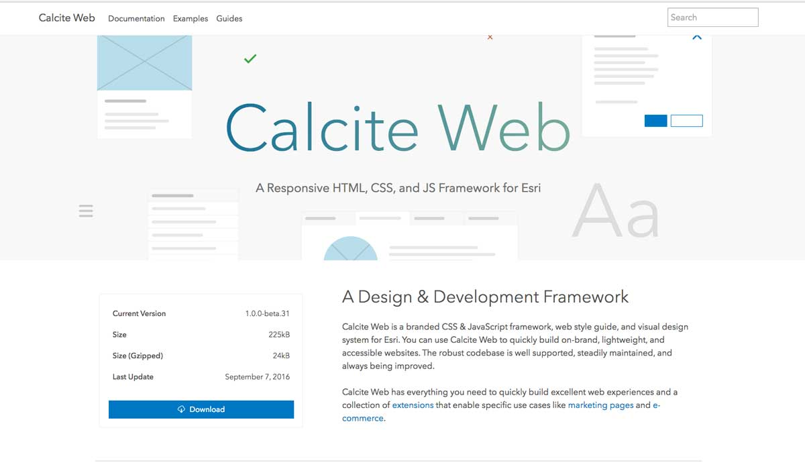
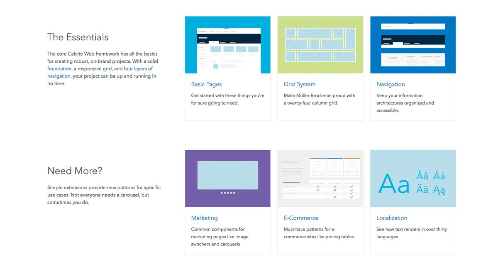

Different teams with with different projects across Esri had been repeatedly solving the same design problems with the resources at their disposal. This resulted in a wide range of web properties that were all different facets of the same platform that had sometimes radically different design decisions. This project created a baseline for teams to work from.

Calcite Web is a sass-based CSS framework that addresses common design problems and interactive elements for Esri. The project allows teams within Esri to quickly build branded, lightweight, accessible websites quickly. A brand-specific front end framework creates a united visual language and user experience across a wide range of web products built by teams all over the world.

The systemic approach to a branded visual and information, along with the development of a robust and central codebase, allows highly focused design interventions into common elements and patterns that are then disseminated across the entire web presence of the company. The framework can be used a framework- and project-agnostic dependency and be used to create themes for other projects like Bootstrap.

