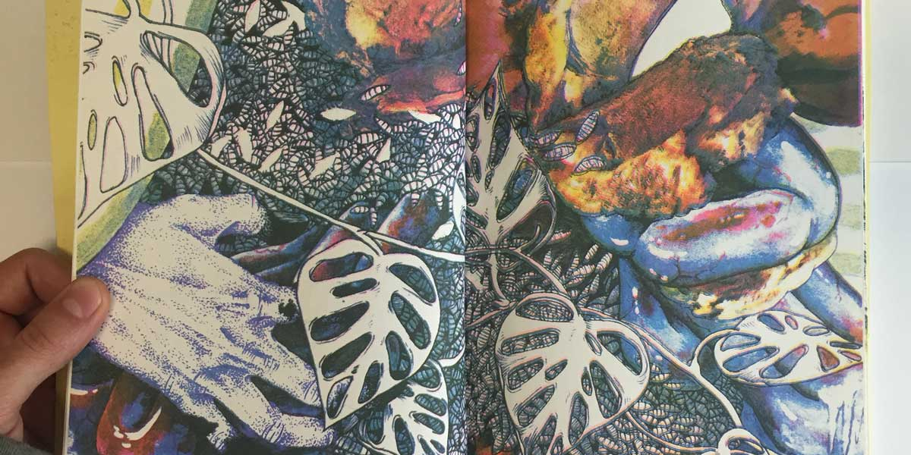
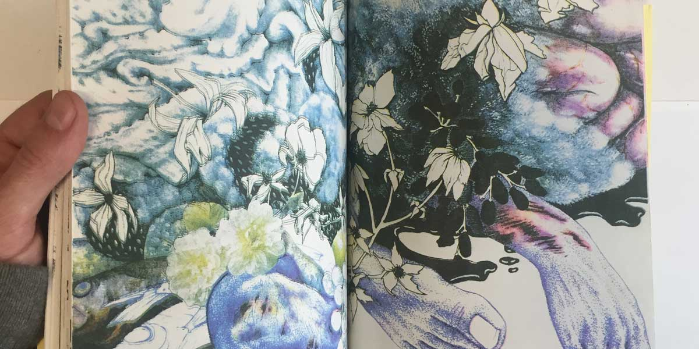
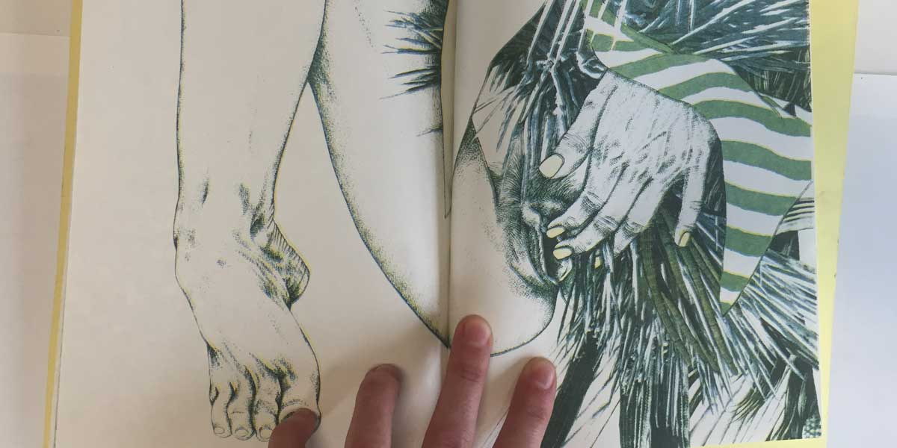

	<a href="http://www.ogpdx.com/morgan-rosskopf-heavy-pop/1a4u531deq9xqrkunjqyk5di9aewey" class="nav-link">Buy the Book</a>

The project is a collection of drawing and collages by Morgan Rosskopf. The book is printed in off-process CMYK and hand bound in experimental reverse drum leaf perfect binding. The monograph works with the rest of the gallery show, acting as documentation and a piece of art in its own right — an object treated in the same manner of a cassette tape for sale at a concert.

Morgan is trained a fine art printmaker, and the multiple is a valuable part of her art practice. This show, however, focused on individual works – drawing and collages. Morgan wanted to provide a low-cost object that worked in the tradition of the multiple to supplement the show without providing literal prints of the work.

The translation between formats, density of image, and literal color space all worked together to create a new interpretation of Morgan's work — some ideas were able to come forward with the process, while others became more muted. The monograph became a unique art object itself, rather than a piece of documentation.

