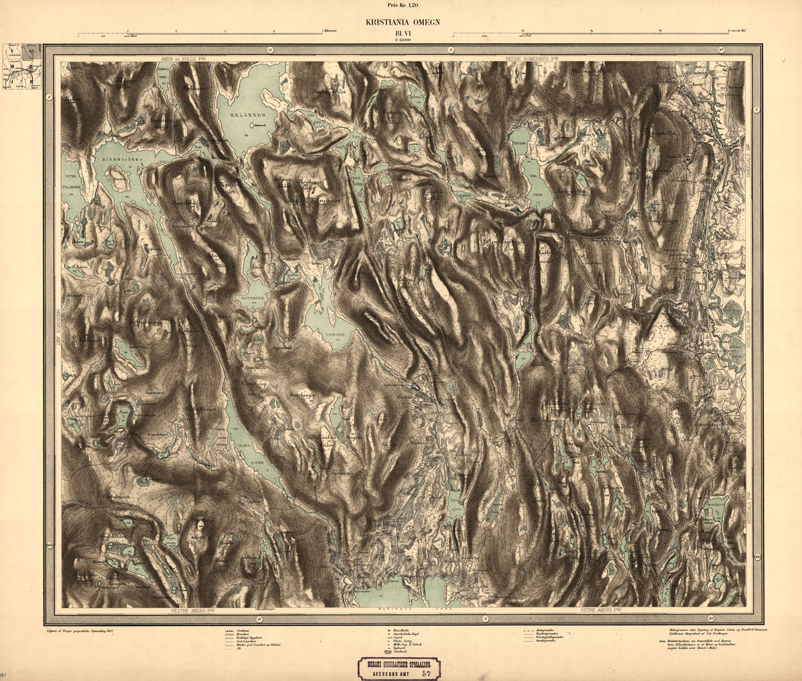
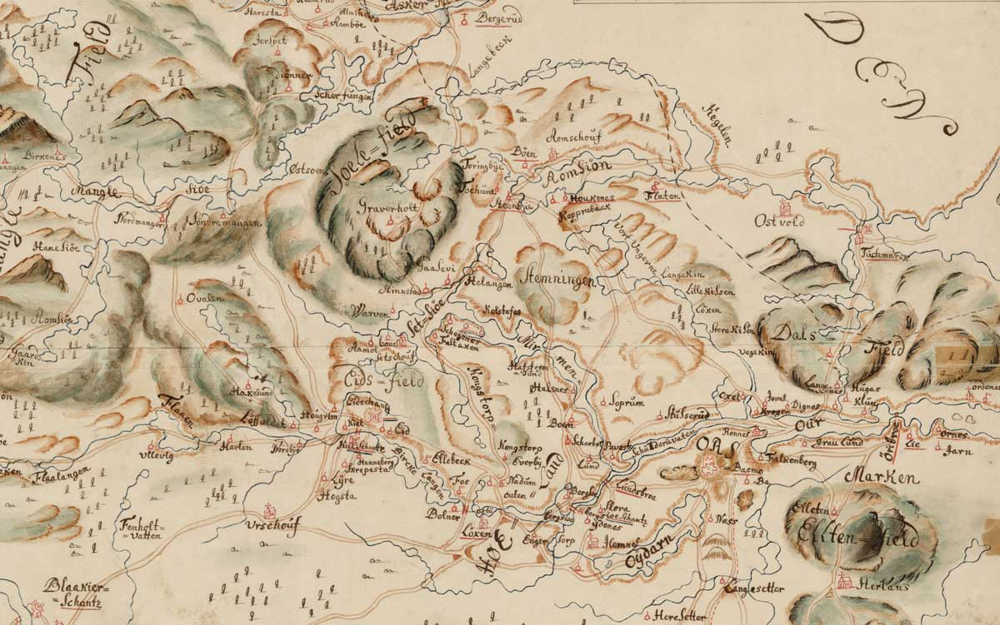
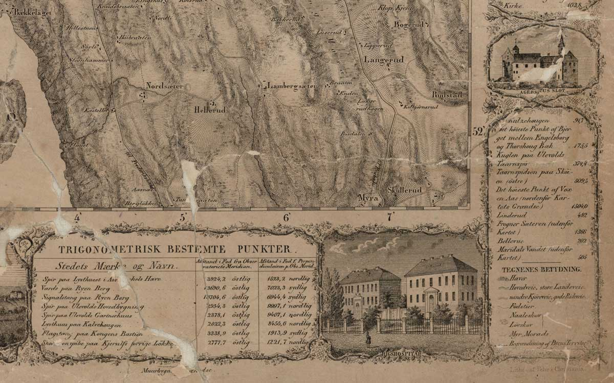
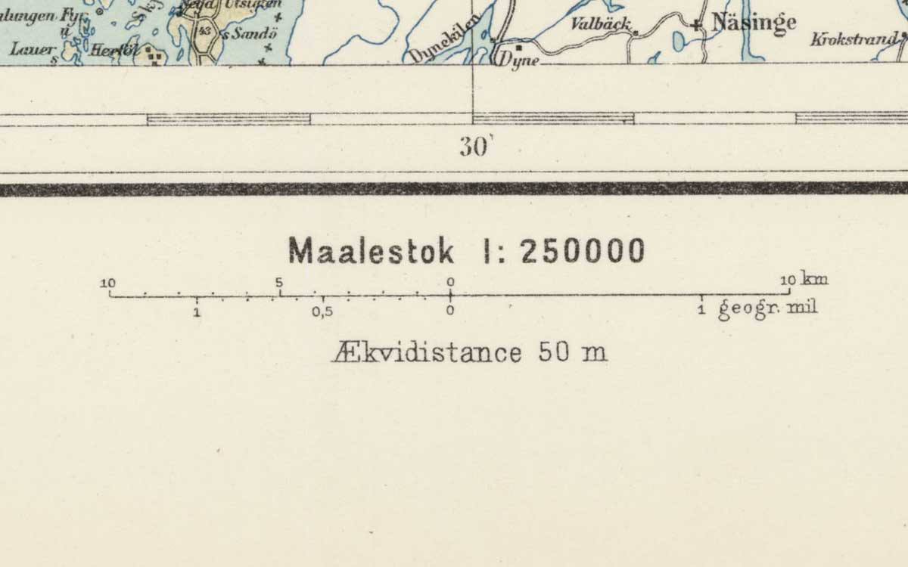
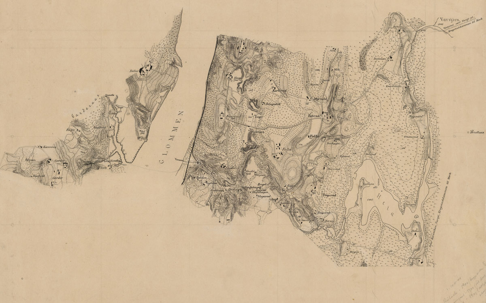
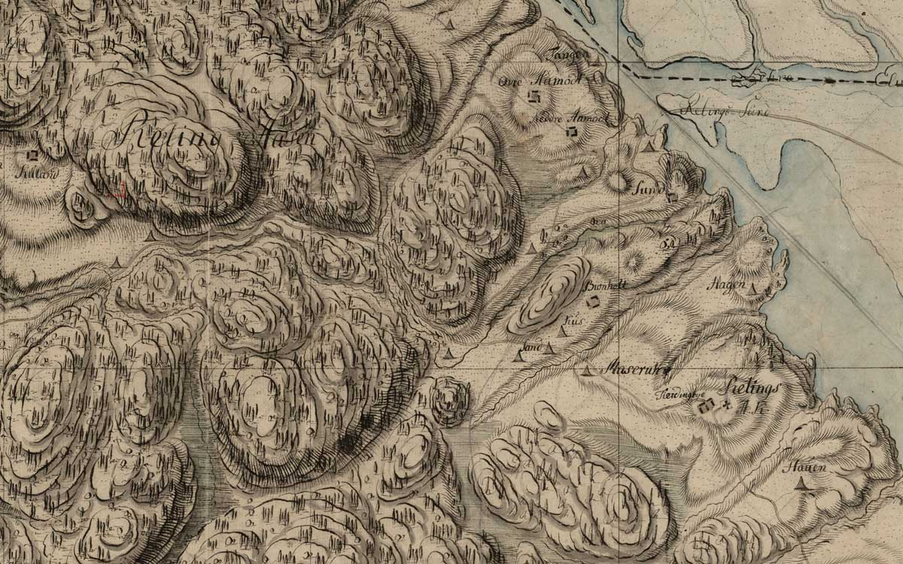
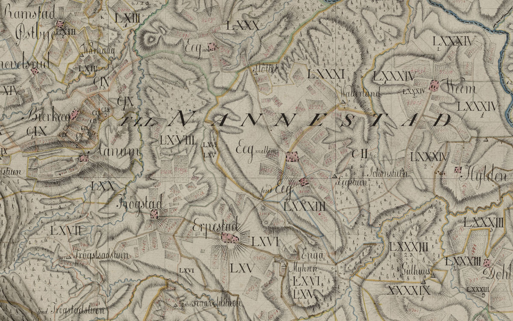

## Mapping as visual design tool

'The Map' is a fairly general conceptual model, a term  valid for describing a wide range of objects. The map at it's core is a tool to provide context for the specific, and illuminate the general. A good map is tailored to communicate on both of these scales simultaneously. They exist to solve a specific problem, defined and shaped by the broader culture that has the problem. In this way the map-as-object inherently takes a perspective inseparable from the societal culture that creates and uses the object. As a tool of communication, an analysis of the formal aspects with a knowledge of broader context can illuminate specific decisions, needs, and solutions that can provide the design tools needed to create maps on the web as successful, and beautiful, as maps on paper.

## The Means of production

Before the advent of digital production and distribution, there were only two types of maps - one-off, non-reproducible maps (drawing as object), and multiple, reproducible maps (print as object). In this way, the technical history of the map is tied directly with the history of printmaking. While the drawing of the map is requisite for both objects, the printed map added a technical process to the creation of maps, influencing the style of requirements for for the drawn map. As with the addition of digital technical processes today, the underlying drawing and visual tools needed to succeed within each the new environments of technical production change with production techniques.

The maps from Norway that were produced in the 1920's through 50's were printed lithographically, most likely using an offset press. Earlier maps from the 1890's are also lithographic, although these are likely printed on traditional stone lithography presses. The lithographic process is binary - either inked or not inked - rather than truly tonal, so this leads to the need to create tonal range via cross-hatching and half-toning. As with any printing process, each color was drawn as a single plate - or layer - meaning that a limited color palette is rewarded by lowered production costs. In this way, it's very common to see two or three color maps using a wide range of halftones to create depth and richness, along with the use of thematically grouping objects by color. Landscape features occupy the key (black) layer, communication of water features shares the blue layer, building footprints are gathered all together on the orange layer. This visual technique keeps a single set of data together on a single drawn layer, with the design advantage of having clear, semantic, color-coded maps.

## Formal aspects
Thinking of 'map-as-object' leads us to consider the map as the *entire* object. Rather than conceptually separating the map from the frame from the margin from the scale bar and legend, the map needs to be thought of as the entire physical object of the paper and the print. These concepts are inextricable, and their consideration leads to the design solutions we see today. The printing plate has physical limitations of workable size, the paper has the physical limitations of production and quality, the ink has the physical limitations of light-fastness, pigment density, and transparency.

We see the response to these physical limitations in the layout and design of the printed image: The paper can be larger than the plate giving room for whitespace that frames the printed area, allowing the hands hold the object without obscuring it and creating a focal point in the interplay between figure/ground. Visual framing devices - representations of frames, double ruled ornaments - clearly mark the transition from margin to image. This creates room for the framing device to pull double duty as decorative assistance to the image and semantic indicators of scale, proportion, and contextual reference.

The plates for the multi-layered geographic representation may be separated from the legends, scales, and other marginalia. This means that the legend - without which the map must rely on implied semantic connotations - and scale bar - without which the map looses it's reference to the lived-in world - can occupy the white space, either centered along on axis, or across the compass points.

The map-as-object of multi-layered printed images on paper invites these specific solutions to a set of questions: How do we distribute this image? How do we make sense of it once we have? How do I understand the cultural context of this object? In these illustrations - digital representations of physical objects - we naturally avoid another aspect of the map-as-object: the reverse side of the sheet. The contents of both the recto and verso, along with the physical context of it's distribution (bound in an atlas? rolled and sealed? sheafed flat in a stack and stored?) will provide further understanding of the map.

## Exaggeration, simplification, and generalization

It could be argued that any exercise in mapping is the practice of exaggeration, simplification, and generalization. Representing the complexity of the lived world to semiotic structures of the map through design requires all three techniques of reduction, filtered through the subject of communication. Accepting that the tools available for graphic communication will necessarily distort or obscure the reality of the place being mapped, the question becomes how to use this distortion to strengthen the ideas being presented.

### Exaggeration

The depiction of the rolling hills from the historical Norwegian maps of the 1770's show graphic exaggeration of the landscape in order to communicate the density and character of the countryside, not necessarily the precise contours of the landscape, but rather the nature of the topography – perhaps highlighting the valleys and ravines _between_ the hills rather than the hills themselves. This technique is seen with the early, hand drawn maps, and is carried through for several decades.

## Simplification

The removal of as many graphic elements as possible to leave behind only the essential, meaningful information forces the designer to ask what they are trying to communicate, and what they absolutely need to include to provide meaningful context. The question becomes what can be removed from a map, what can be abandoned without harming the intended message. Seen at the extreme, this technique can be used to provide a simple, clear map on a single topic.

## Generalization

While symbology is the most common form of generalization with the map – this dot represents this structure, defined by the legend – there are some strong examples of generalization of both built and natural forms throughout the entire collection of historical Norwegian maps. Leaving behind the precise symbols, the idea and feeling of a place can be communicated by the generalized shapes of things, their interplay and juxtaposition in their simplicity can evoke a deeper knowledge of place than the precise representation. In this section for an 1805 map, the uneven shapes of what seem to be fields jostle with the simple drawings of trees, the hills, the rivers, and the yellow demarcation lines. The abstraction of the terrain makes it more of a place one that can be imagined and recognized.