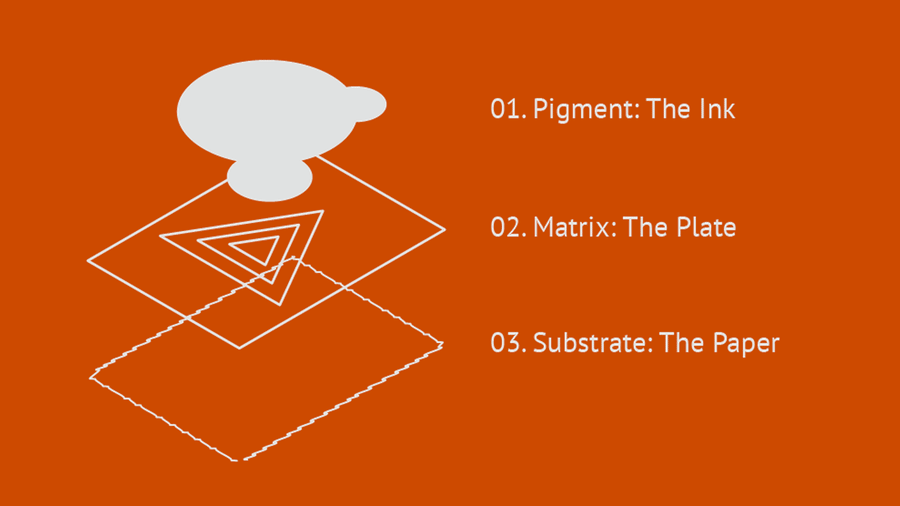
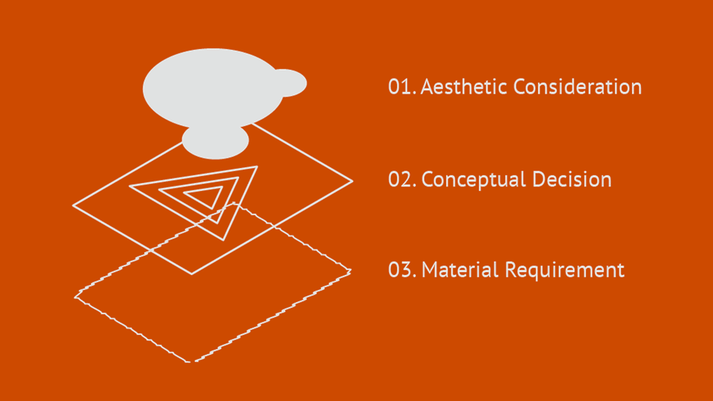
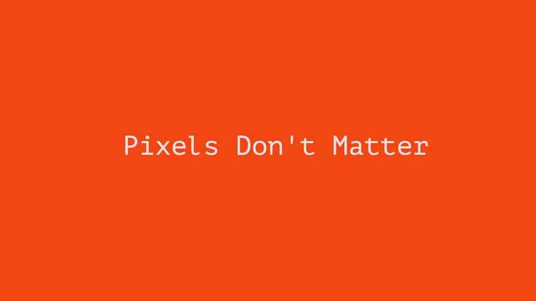
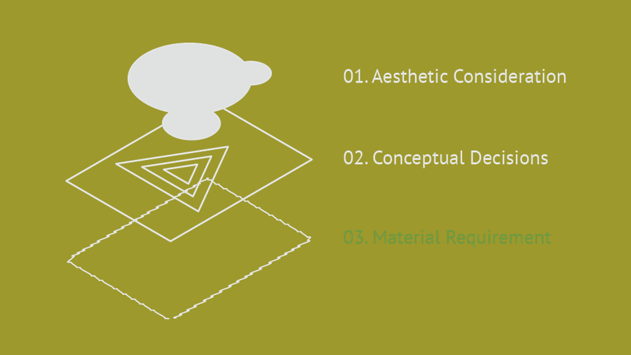
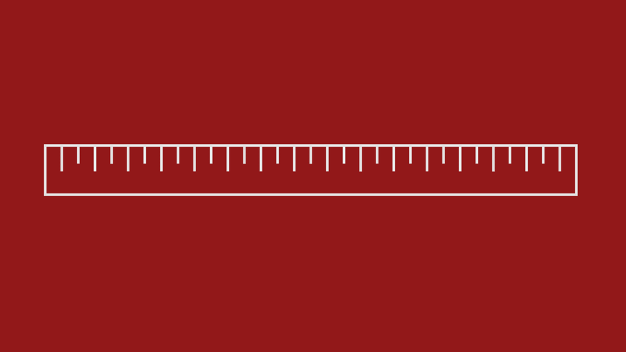
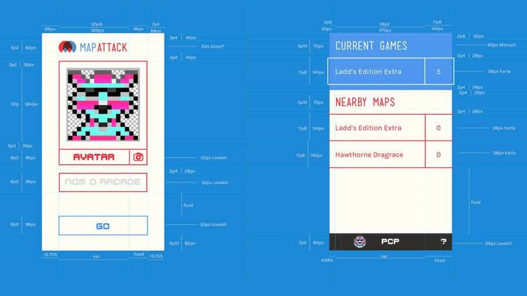
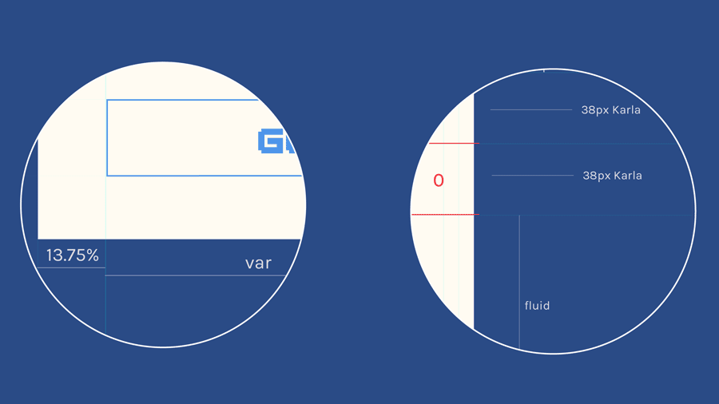

Talking about mobile design today, the conversation is couched in terms of "pixel perfect", or designs are made by "pixel pushers". This isn't a useful way to approach layout design.

In the analog world we talk about the three fundamental components of print.

I know what you're thinking right now; "Wait, we're not analog here." We're digital. We need pixels. And that's true, we do need pixels. Let's reframe these principles:

Thinking about our substrate, our materials are our devices, which render with pixels.

## But our materials change -

Our devices get more and more pixel density, their proportions change, technology improves, CSS abstracts a 'pixel' of its own, Android exists, and all of a sudden our materials get away from us and focusing on the pixel gives us an aneurysm.

But don't worry, because:

## We still have two other layers to work through.

Our materials don't dictate our aesthetics nor or concept, but materials do inform our decisions. So think about pixels, but put them in the proper place - as the substrate of our work.

## Measurement systems are abstract ideas -

An inch is not a thing, a foot is not a thing. The pixel is a phsyical thing, and as a physical thing we've seen that it's prone to change.

## The pixel is a terrible way to measure things.

So use another system to measure, any other system. The ratios, the proportions, the relationships and the hierarchies are important. That's where we do our work as designers.

So don't stress pixels. Spare them a thought when you get started, and know that at some point in the process they'll make themselves apparent, and will need to be addressed. But the pixels will let you know, and when you need to deal with them they'll be there.

## Show Time
These are some comps for the [MapAttack](/projects/mapattack) mobile app.

Every element is specified by exact pixel counts. The typefaces are defined, the margins, the padding, and the border strokes are each precisely determined and labeled.
Don't get the wrong idea - this isn't my hypocrisy you're seeing. These designs didn't *start* life here, this is just where they ended up.

Before handing off my design, I basically ran pre-press on it. Our developers do need pixels - they need these values. They need them for execution and production. So we, as their designers, need to give them pixels. But we also need to give them more than just that.

We need to give them the blueprints for how we *think* about the design. That means showing what's proportional as proportion, showing what's fluid as fluid. This gives our static comps the life they need to work for a huge range of devices.

## Love the Pixel, let it be a Pixel.

Letting Pixels be beautiful, blocky, physical little things means using them to render our designs, not dictate them. It means using actual measurement systems to measure. And more importantly, it gives us a way to understand our layout better, to arrive at more considered designs, and to understand our designs as they live on actual hardware in the actual world.
